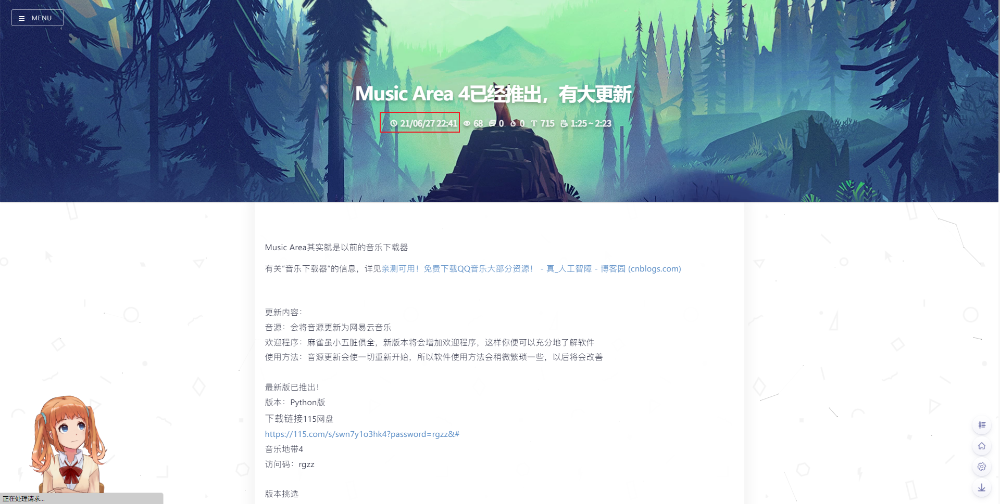
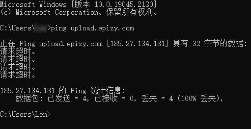

# 引（纯）入（粹）主（瞎）题（扯）

好的各位我回来了

你们一定记得我答应过你们

> **本人这段时间内将不再更新Music Area！**

但是你们自己看看过了几段时间了

~~看板娘：这也太早了吧（划去~~

# 进入正题

这个软件可以免费下载网易云上所有能在线听的音乐。如果你想下载更多，你可以在自己的电脑或服务器（也可以是各种奇怪的设备，譬如路由器或者机顶盒？）上部署Unblock Netease Music。然后修改代码中API请求部分的参数，这样就可以配置请求时使用的网络代理，在下载时调用UNM来下载部分灰色或试听音乐。

**如果您知道UNM的免费API网址，或者您拥有部署了UNM的服务器并愿意贡献，则可以联系我。**

## 使用步骤（5.x版本）

这个版本的界面采用了多标签的逻辑，把不同的功能区分开，每一页中包含该功能所需的一切控件，底部常驻三个功能按钮。~~（莫名想起安卓三大金刚键~~

您需要在分页标签栏选择您需要的功能，接下来按照对应分支操作。

### 搜索下载与收藏下载

然后再下面的输入框内填入该功能需要的全部信息，再点击按钮或在最后一个输入框按下Enter来开始。

随后铺满界面空白的的列表框中会显示出结果，选择您需要下载或收听的音乐，再点击底部三键中的“下载”来下载。

如果您不确定哪一个是您需要的音乐，您可以选中一首，然后点击“收听”来下载到缓存文件然后试听。

如果您需要分享该音乐或者查看歌曲详细信息，那么您可能需要歌曲ID，选中一曲，然后点击“复制歌曲ID”来获取该歌曲的ID。

### 友好输出

如果软件遇到了问题但未崩溃，您可以点击“友好输出”标签，然后在控制台中查看简化的输出信息，进行简单的排错。

### 关于

您可以在此查看软件信息，以及我的一些警告。

## 更新记录（5.x）

### 5.0.0

- 全面改用Netease CloudMusic API，更加稳定。
- 使用系统控件样式及多标签界面逻辑，更加稳定易用。

### 5.0.1

- 由于vercel.app被墙，改用其他域名并设置CNAME转发，感谢`愿为西南风`（QQ）和我足够厚的脸皮……

### 5.1.0（当前）

- 增加加载界面
- 现在在下载音乐时，可以一并下载并填入歌曲名称、歌手、专辑等，但我目前并未解决填入专辑图的问题
- 修复一堆已知BUG

## 未实现的功能

### UNM支持及自定代理

由于我懒，所以懒得做自己修改代理的功能，然后我又没有VPS，所以也不能直接把代码写死……

### “作者在听”功能

我原本打算制作一个功能，可以查看我收藏的音乐。但是我把收藏设置公开后还是无法直接访问，我又不想在代码里透露我的代码或者cookie，所以我就只能把这些获取收藏的代码用PHP写出，丢到服务器上当作API用，但是这么做似乎还是没法跑起来。（或许是我的代码有毛病？）

最后因为PHP开发寸步难行，再加上我的服务器FTP寄了……然后这个功能它就废掉了

我把写了一半没用的php代码扔进存储库了，感兴趣的自己下载看看吧，我已经把账密屏蔽了。

### 下载专辑图

事实上，是可以下载的，就是eyed3根本没法把专辑图写到mp3里啊啊啊啊啊啊啊啊啊啊啊啊啊啊啊啊啊啊啊！！！！！！！！！！！！！！！

### 使用专用音频播放器加快音频预览速度

这个点子我有了好久了，但是我没有找到适合的播放器。我的要求：显示歌名，不能切歌，带暂停播放和进度条，最好能直接传入音频文件内容来直接播放。

这样吧，这个功能**你行你上！**

如果你愿意帮我，还是联系我就行了